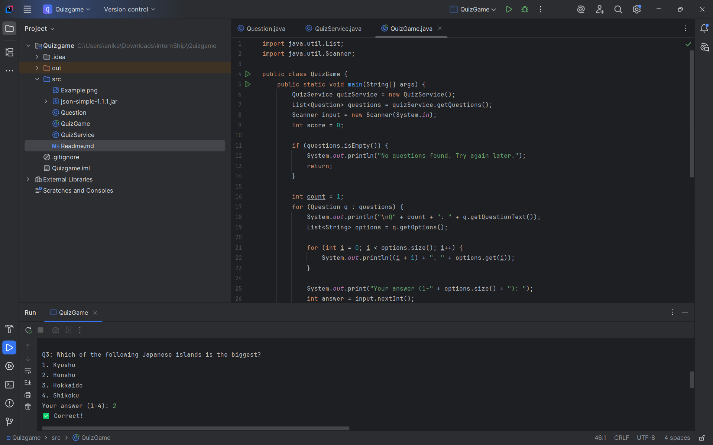

# Java Quiz Game (Console-Based)

This is a simple Java console application that fetches multiple-choice questions from the Open Trivia DB API and allows users to take a quiz. It demonstrates basic API integration, JSON parsing, and user interaction through the terminal.

---

## Features
- Gets live quiz questions from API
- Randomizes multiple-choice options
- Accepts user input and checks answers
- Tracks score and shows final result

---

## Technologies Used
- Java (JDK 8+)
- JSON.simple (v1.1.1)
- Open Trivia DB API
- IntelliJ Idea

---

## Files Included
- `QuizGame.java` – main game logic
- `QuizService.java` – handles API and parsing
- `Question.java` – model for each question
- `json-simple-1.1.1.jar` – library for JSON

---

## How to Run

On IntelliJ

Open project → Add .java files to src

Add json-simple-1.1.1.jar to 

Project Structure → Libraries

Run QuizGame.java

## API Used
Open Trivia DB

Example: https://opentdb.com/api.php?amount=5&type=multiple

### Sample JSON Response:
```json
{
  "response_code": 0,
  "results": [
    {
      "category": "General Knowledge",
      "type": "multiple",
      "difficulty": "easy",
      "question": "What is the capital of Australia?",
      "correct_answer": "Canberra",
      "incorrect_answers": ["Sydney", "Melbourne", "Perth"]
    }
  ]
}
```
## Screenshot Example 
Below is a screenshot showing the quiz running in IntelliJ IDEA:



Submitted by  Soumya Gurjar
